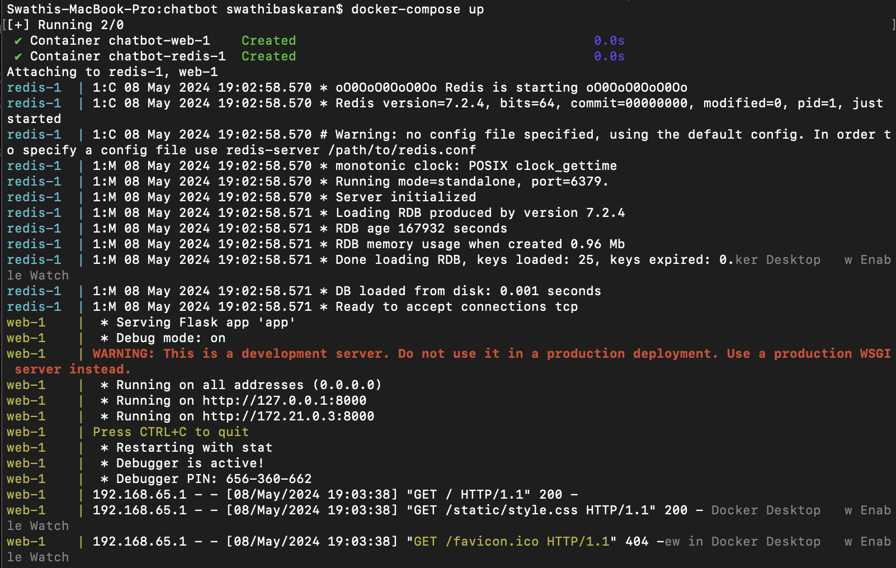
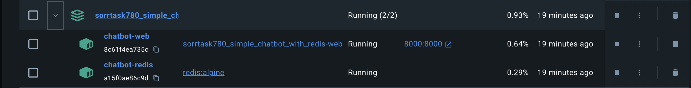

# Simple-Chatbot-with-Redis


## Author

- Author: Swathi Baskaran
- GitHub Handle: 11swathi
- Email: swathib@umd.edu


## Link to the video explanation

Link: https://drive.google.com/file/d/1hGhIeJZ1arcEJYY0HQFQdoVAvQIxujQm/view?usp=sharing


## How to run the project?

- This project utilizes Docker to run two containers: `chatbot-redis` for caching and `chatbot-web` for hosting the chatbot application

- Open the terminal and navigate to the project directory `sorrentum_sandbox/spring2024/SorrTask780_Simple_Chatbot_with_Redis`

- Run the following command to build the containers
    ```bash
    docker-compose up --build
    ```

- Next time when you run the code, you can run the containers with the below command, as it is already built
    ```bash
    docker-compose up
    ```

- Once the containers are built, open a web browser and enter `localhost:8000` or `https://127.0.0.1:8000` in the address bar.

    

- You can now interact with the chatbot by typing in the message box

- Navigate back to Docker Desktop to view the built containers `chatbot-redis` and `chatbot-web`. It should ideally look like this:

    

- Another option, open another terminal and enter the command to see the running containers

    ```bash
    docker ps
    ```

- To stop the containers, simply press `CLT+C` to stop the containers in terminal or use command 
    ```bash
    docker-compose down
    ```

- Open another terminal window and run the following command to access the Redis CLI within the `chatbot-redis` container 
    ```bash
    docker exec -it <redis container name e.g. chatbot-redis> redis-cli
    ```
- Once inside the Redis CLI, enter the following command to view the cached data
    ```bash
    KEYS *
    ```
- Type `exit` to come out of the Redis CLI
